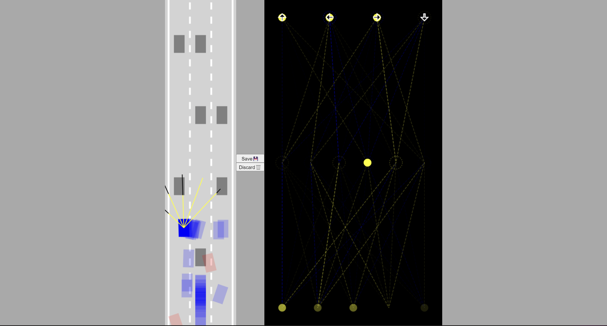

# Self-Driving Car JS No Library

## Project Desription:

This project implements Car Physics, Artificial sensors, Collision detection, a Neural Network & Visualizer, and the Genetic Algorithm using no libraries

The self-driving car project is from [Radu's tutorial](https://www.youtube.com/watch?v=Rs_rAxEsAvI&t=1s) on FreeCodeCamp and his seperate [neural network visualizer tutorial](https://www.youtube.com/watch?v=lok3RVBwSqE)

Example:

[Test it out!](https://pongpatapee.github.io/self-driving-car-js/)